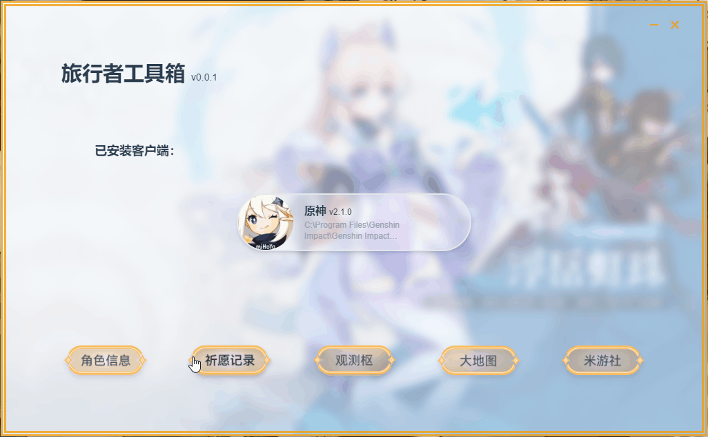

# 旅行者工具箱 | Genshin Traveler Toolbox

> 向着星辰，与深渊

献给各位[《原神》](https://ys.mihoyo.com/)提瓦特世界的旅行者们！

希望大家喜欢~

目前只支持Windows端

（非官方）

## 功能

- 目前只做了祈愿记录分析，只要点几下就能看到结果啦！

### TO-DO

不知道什么时候能做好的功能，先杀一只鸽子祭天好了。~~（提米：你礼貌吗？）~~

- [ ] 支持导入/导出祈愿记录
- [ ] 更多样的祈愿分析图表
- [ ] 角色信息
- [ ] _________________欢迎提需求！

## 碎碎念

本项目不记录、存储、上传任何数据，不对游戏进行任何写入修改操作，请放心食用~

丢一个企鹅群号在这：[473621711](https://jq.qq.com/?_wv=1027&k=cSZF6v41)
使用反馈、聊天、玩游戏什么的都可以来哦！

啊...还有什么要说的来着？

**强烈欢迎感兴趣的大佬们参与设计和开发！！！**

## 致谢

- [electron-vue-next](https://github.com/ci010/electron-vue-next) 相当方便的Electron+Vue3开发模板，本项目基于该模板开发
- [genshin.dev API](https://github.com/genshindev/api) 角色和武器的图片从这儿搬来的，虽然似乎不太全
- [原神祈愿记录导出工具](https://github.com/biuuu/genshin-wish-export) 一个也很好用的工具
- [@我叫南瓜_Pumpkin](https://weibo.com/5991550266/KtqXNc5nh) 授权使用logo图片
  > 她还画了其他的比如[史莱姆](https://weibo.com/5991550266/KteqYC60G)都好可爱！选丘丘人做logo只是感觉更合适...

## License

[MIT License](./LICENSE)

> 虽然但是，希望不要被人**直接**拿去卖钱或者干什么坏事吧...这里不收费也没广告的惹

> 本项目所使用的游戏资源（包括但不限于：游戏图片、数据等），其版权归属于**上海米哈游网络科技股份有限公司**和（或）其关联公司。
